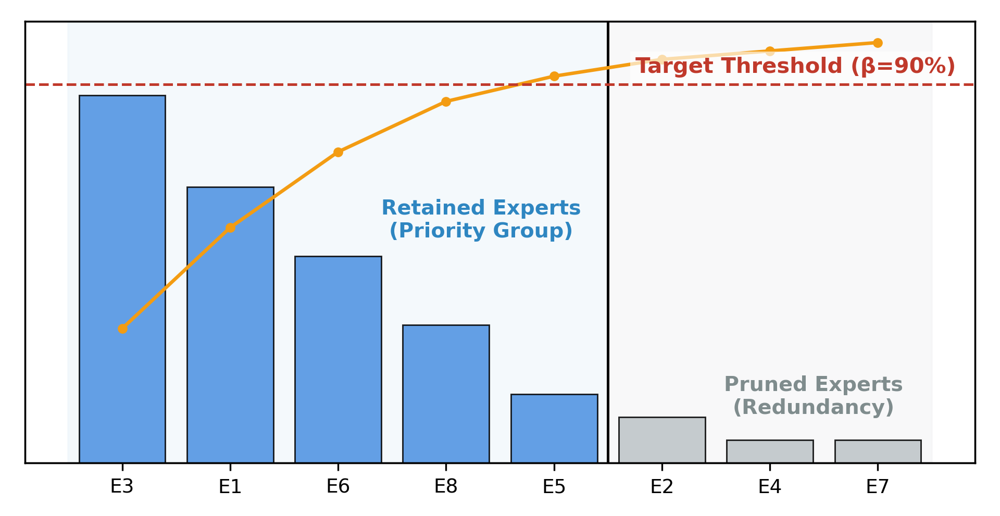
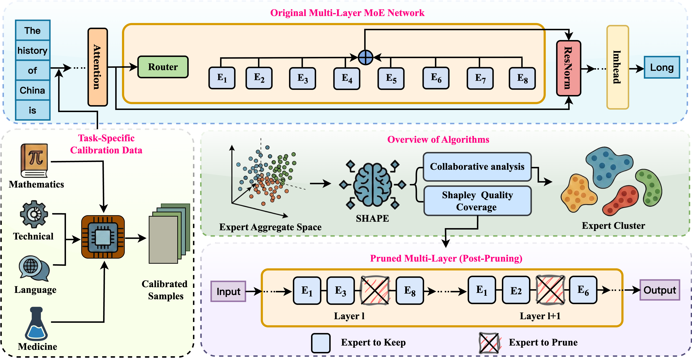
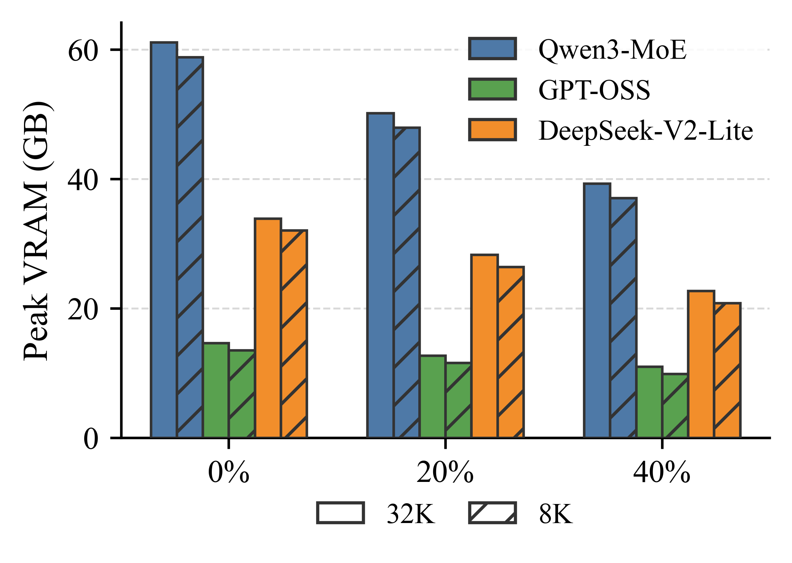

# SHAPE: Coalition-Aware Expert Pruning for Sparse MoE LLMs

**SHAPE** (**SH**apley-**A**ware **P**runing of **E**xperts) is a training-free pruning framework for sparse Mixture-of-Experts (MoE) large language models. It reduces the number of resident experts needed at inference time while preserving the cooperative routing structure that makes MoE models effective.

This repository accompanies the IJCNN 2026 work:

> **SHAPE: Coalition-Aware Expert Pruning for Sparse Mixture-of-Experts LLMs**

Sparse MoE models activate only a few experts per token, but the full expert pool still has to stay in GPU memory for dynamic routing. SHAPE targets this memory wall by pruning redundant experts after pretraining, without changing router logic, retraining experts, or modifying the model architecture.

<p align="center">
  
</p>


## Highlights

- **Coalition-aware expert valuation.** SHAPE treats routed top-k experts as a coalition instead of scoring each expert independently.
- **Training-free pruning.** It uses only a small calibration set and routing traces from the original model.
- **Layer-aware quality coverage.** It keeps the smallest expert subset that preserves enough Shapley contribution mass per layer, then uses bisection to match a target global keep rate.
- **Modern MoE backbones.** The experiments cover Qwen3-30B-A3B, GPT-OSS-20B, and DeepSeek-V2-Lite.
- **Practical memory savings.** Removing 20% or 40% of experts reduces peak VRAM while keeping task performance stable across reasoning, coding, QA, and NLP benchmarks.

## What SHAPE Does

Most expert pruning methods score experts in isolation, using signals such as routing frequency, router probability, or activation magnitude. That misses a key property of sparse MoE inference: each token is processed by a **coalition** of routed experts. An expert can be valuable not because it appears often, but because it completes a high-utility expert group.

SHAPE reframes pruning as a cooperative attribution problem:

1. Run the unpruned model on a small task-specific calibration set.
2. Record top-k expert combinations at every MoE layer.
3. Build an empirical cooperative game from observed expert coalitions.
4. Estimate Shapley-style contribution scores for experts inside each layer.
5. Select experts with a quality-coverage rule that preserves layer-wise contribution mass.
6. Export a compact MoE model for serving.

<p align="center">
  
</p>

## Method Overview

Given a pretrained sparse MoE model and a downstream task, SHAPE performs an offline calibration pass. For every calibration token, it records which experts are co-activated by the router in each MoE layer. These traces define the observed coalition support for that task.

For each expert, SHAPE estimates how much marginal value it contributes inside the coalitions where it appears. The approximation uses routing frequency and co-occurrence statistics, avoiding expensive repeated forward passes over many masked expert subsets.

After scoring, SHAPE applies **Shapley Quality Coverage**. Instead of keeping a fixed number of experts in every layer, it keeps the smallest prefix of high-value experts whose cumulative contribution reaches an alpha fraction of that layer's Shapley mass. The alpha threshold is chosen by bisection so the final retained expert count matches the target keep rate.


## Results at a Glance

SHAPE is evaluated on three sparse MoE backbones and seven benchmarks: GSM8K, HumanEval, GPQA-Diamond, MATH-500, TruthfulQA, OntoNotes5, and MedMCQA. Each task uses 25 calibration examples to collect routing traces.

### Accuracy Under Expert Pruning

The table below reports task-average accuracy from the IJCNN 2026 experiments. A keep rate of `0.80` means 20% of experts are pruned; a keep rate of `0.60` means 40% of experts are pruned.

| Model | Baseline | 20% Pruned | 40% Pruned |
| --- | ---: | ---: | ---: |
| Qwen3-30B-A3B | 82.92 | 82.43 | 81.31 |
| GPT-OSS-20B | 82.12 | 82.44 | 79.02 |
| DeepSeek-V2-Lite | 62.08 | 62.44 | 58.81 |

At 20% pruning, average performance remains comparable to the unpruned models and can slightly improve on some backbones, suggesting that part of the expert pool has limited marginal utility for the evaluated tasks. At 40% pruning, degradation increases but remains bounded, especially on larger MoE backbones.

### Baseline Comparison on Qwen3-30B-A3B

SHAPE is strongest under aggressive pruning, where preserving critical expert coalitions matters most.

| Rate | Method | GSM8K | HumanEval | GPQA-D | MATH-500 | TruthfulQA | OntoNotes5 | MedMCQA | Avg |
| --- | --- | ---: | ---: | ---: | ---: | ---: | ---: | ---: | ---: |
| - | Unpruned | 96.21 | 95.73 | 58.59 | 96.80 | 77.60 | 87.15 | 68.35 | 82.92 |
| 20% | Random | 61.24 | 58.36 | 21.42 | 60.27 | 42.31 | 71.16 | 38.18 | 50.42 |
| 20% | Frequency | 86.12 | 86.37 | 40.12 | 88.14 | 64.05 | 82.17 | 58.12 | 72.16 |
| 20% | Gating | 87.42 | 87.15 | 42.18 | 89.36 | 65.41 | 83.24 | 59.27 | 73.43 |
| 20% | RAEP | 95.47 | 94.52 | 57.56 | 95.42 | 76.42 | 86.14 | 67.51 | 81.86 |
| 20% | EASY-EP | 95.82 | 95.01 | 58.12 | 95.86 | 77.14 | 86.54 | 67.96 | 82.35 |
| 20% | **SHAPE** | **96.74** | **95.12** | **60.10** | **96.80** | 75.64 | 84.42 | **68.18** | **82.43** |
| 40% | Random | 35.43 | 28.27 | 8.28 | 32.15 | 21.29 | 60.41 | 15.46 | 28.76 |
| 40% | Frequency | 75.14 | 72.11 | 20.16 | 72.29 | 45.18 | 76.28 | 40.17 | 57.33 |
| 40% | Gating | 77.19 | 74.32 | 22.54 | 74.28 | 47.21 | 77.31 | 42.15 | 59.29 |
| 40% | RAEP | 93.42 | 90.47 | 52.42 | 92.58 | 43.12 | 83.15 | 64.41 | 74.22 |
| 40% | EASY-EP | 94.12 | **91.07** | 53.12 | 93.14 | **73.28** | **83.51** | 65.14 | 79.05 |
| 40% | **SHAPE** | **95.60** | 89.63 | **67.68** | **94.40** | 73.16 | 82.37 | **66.32** | **81.31** |

### Peak VRAM

Pruning directly reduces the resident expert footprint. The measured peak VRAM decreases steadily under 20% and 40% expert pruning for both 32K and 8K context settings, with no additional training or architecture changes.

<p align="center">
  
</p>

## Repository Structure

```text
shapley-moe/
|-- data/                         # Calibration data and download scripts
|   |-- calibration/              # 25-example calibration sets
|   |-- download_dataset.py
|   `-- run_download.sh
|-- analysis/                     # Routing trace collection and Shapley scoring
|   |-- collect_activations.py
|   |-- calc_shapley.py
|   |-- run_collect.sh
|   `-- run_calc_shapley.sh
|-- pruning/                      # Expert selection and pruned-model export
|   |-- methods/
|   |   |-- select_by_shapley.py
|   |   |-- select_by_easyep.py
|   |   |-- select_by_reap.py
|   |   |-- select_by_gating.py
|   |   |-- select_by_frequency.py
|   |   `-- select_by_random.py
|   |-- save_model.py
|   |-- run_select.sh
|   `-- run_prune.sh
|-- finetune/                     # Post-pruning adaptive LoRA fine-tuning
|   |-- build_rank_map.py
|   |-- train_adaptive_lora.py
|   |-- merge_lora.py
|   `-- infer_adaptive_lora.py
|-- evaluation/                   # vLLM serving and EvalScope evaluation
|-- configs/                      # Model paths and experiment settings
|-- results/                      # Activations, Shapley values, selected experts
|-- assets/                       # README figures
`-- PROJECT_STRUCTURE.md
```

## Quick Start

### 0. Configure Models and Experiments

Edit the config files before running the pipeline:

```bash
vim configs/models.yaml
vim configs/experiments.yaml
```

`configs/models.yaml` defines model paths, expert counts, top-k routing size, and MoE module patterns. `configs/experiments.yaml` defines calibration datasets, keep rates, pruning methods, and evaluation defaults.

### 1. Prepare Calibration Data

```bash
cd data

# Download one dataset with 25 examples.
./run_download.sh gsm8k 25

# Or download all datasets from configs/experiments.yaml.
./run_download.sh --all
```

### 2. Collect Routing and Activation Statistics

This single pass collects the information needed by SHAPE and the baseline pruning methods.

```bash
cd analysis

# Use a configured model name.
./run_collect.sh -m qwen3-30b-a3b --all

# Or use a full model path.
./run_collect.sh -m /path/to/model --data ../data/calibration/gsm8k_25.json

# Inspect configured models.
./run_collect.sh --list-models
```

Outputs are written to:

```text
results/{model_name}/activations/
```

### 3. Compute Shapley Values

```bash
cd analysis

# Compute Shapley scores for all available activation files.
./run_calc_shapley.sh -m qwen3-30b-a3b

# Or compute one dataset.
./run_calc_shapley.sh -m qwen3-30b-a3b -d gsm8k_25
```

Outputs are written to:

```text
results/{model_name}/shapley_values/
```

### 4. Select Experts

```bash
cd pruning

# SHAPE selection with 80% keep rate, i.e. 20% expert pruning.
./run_select.sh -m qwen3-30b-a3b -d gsm8k_25 -M shapley -r 0.8

# Run all configured keep rates.
./run_select.sh -m qwen3-30b-a3b -d gsm8k_25 -M shapley --all-rates

# Run all datasets and all configured methods.
./run_select.sh -m qwen3-30b-a3b --all-datasets --all-methods --all-rates
```

Selected expert files are written to:

```text
results/{model_name}/selected_experts/
```

### 5. Export a Pruned Model

```bash
cd pruning

# Export a SHAPE-pruned model from the selected experts.
./run_prune.sh -m qwen3-30b-a3b -d gsm8k_25 -r 0.8

# Use another method or keep rate.
./run_prune.sh -m gpt-oss-20b -d arc_easy_25 -M easyep -r 0.6
```

The pruning script finds the matching selected-expert JSON and writes a pruned Hugging Face model directory.

### 6. Optional: Adaptive LoRA Fine-Tuning

The `finetune/` scripts implement a post-pruning LoRA recovery path. The current minimal experimental loop targets Qwen3-30B-A3B on `gsm8k_25` with SHAPE-selected experts.

Build a LoRA rank map from Shapley scores and selected experts:

```bash
python finetune/build_rank_map.py \
  --shapley_csv results/qwen3-30b-a3b/shapley_values/gsm8k_25_shapley.csv \
  --selected_experts results/qwen3-30b-a3b/selected_experts/shapley_alpha_per_layer_gsm8k_25_rate0_8.json \
  --output results/qwen3-30b-a3b/lora_rank_maps/gsm8k_25_rate0_8_bucket.json \
  --strategy bucket
```

Default adaptive rank allocation is layer-wise and only over retained experts:

```text
Top 20% retained experts -> rank 32
Next 40% retained experts -> rank 16
Last 40% retained experts -> rank 8
```

The matched baselines are:

```text
uniform: all retained experts use rank 16
random: same bucket sizes and rank set as bucket, assigned randomly
```

Rank maps omit pruned experts. During LoRA training, `train_adaptive_lora.py` expands the rank map into full expert module paths and passes only those modules to PEFT, so zeroed/pruned experts do not receive LoRA parameters.

Train an adapter on a pruned model:

```bash
python finetune/train_adaptive_lora.py \
  --model_path /path/to/pruned_qwen3_model \
  --rank_map results/qwen3-30b-a3b/lora_rank_maps/gsm8k_25_rate0_8_bucket.json \
  --train_file data/calibration/gsm8k_25.json \
  --output_dir adapters/qwen3_gsm8k_rate0_8_bucket \
  --model_type qwen3 \
  --bf16
```

Merge the adapter before serving or formal evaluation:

```bash
python finetune/merge_lora.py \
  --base_model /path/to/pruned_qwen3_model \
  --adapter adapters/qwen3_gsm8k_rate0_8_bucket \
  --output /path/to/merged_qwen3_gsm8k_rate0_8_bucket
```

### 7. Evaluate

```bash
cd evaluation

# Start a vLLM server from a configured model.
./vllm-server.sh qwen3-30b-a3b

# Or use a full model path and custom port.
./vllm-server.sh /path/to/model -p 8801

# Run EvalScope evaluation using configs/experiments.yaml.
python run_evalscope.py
```

## Supported Models and Datasets

### Models

| Model name | Experts | Experts per token | Type |
| --- | ---: | ---: | --- |
| `qwen3-30b-a3b` | 128 | 8 | Qwen3 MoE |
| `gpt-oss-20b` | 32 | 4 | GPT-OSS MoE |
| `deepseekv2-lite-coder` | 64 | 6 | DeepSeek-V2 MoE |

### Calibration and Evaluation Tasks

The default config includes calibration sets for code, math, reasoning, medical QA, NLP, and truthfulness:

```text
humaneval_25, gsm8k_25, math_500_25, arc_easy_25, logiqa_25,
gpqa_diamond_25, med_mcqa_25, pubmedqa_25, biomix_qa_25,
ontonotes5_25, truthful_qa_25
```

The IJCNN 2026 main results report GSM8K, HumanEval, GPQA-Diamond, MATH-500, TruthfulQA, OntoNotes5, and MedMCQA.

## Pruning Methods

| Method | Signal | Description |
| --- | --- | --- |
| `shapley` | Coalition-aware Shapley-style contribution | Primary SHAPE method |
| `easyep` | Task-aligned expert selection | EASY-EP baseline |
| `reap` | Weighted activation norm | REAP/RAEP-style baseline |
| `gating` | Mean router softmax score | Router-score baseline |
| `frequency` | Activation count | Routing-frequency baseline |
| `random` | Uniform random selection | Lower-bound baseline |

## SHAPE Selection Strategies

| Strategy | Description | Notes |
| --- | --- | --- |
| `alpha_per_layer` | Preserve an alpha fraction of Shapley mass in each layer | Recommended; used for SHAPE quality coverage |
| `alpha_global` | Preserve alpha coverage globally | Can over-prune some layers |
| `topk_per_layer` | Keep a fixed top-k expert count in every layer | Simple layer-wise baseline |
| `topk_global` | Keep the globally highest-scoring experts | Can cause layer imbalance |

In the paper, the quality-coverage variant (`alpha_per_layer`) is the main SHAPE setting. It outperforms simplified global and rigid layer-wise variants because it preserves cooperative value while avoiding layer collapse.

## Naming Conventions

- Models: `qwen3-30b-a3b`, `gpt-oss-20b`, `deepseekv2-lite-coder`
- Datasets: `{dataset}_{samples}`, for example `gsm8k_25`
- Methods: `shapley`, `easyep`, `reap`, `gating`, `frequency`, `random`
- Keep rates: `0.8` keeps 80% of experts and prunes 20%; `0.6` keeps 60% and prunes 40%
- Selected expert files:
  - SHAPE: `shapley_{strategy}_{dataset}_rate{XX}.json`
  - Baselines: `{method}_{dataset}_rate{XX}.json`
- LoRA rank maps: `{dataset}_rate{XX}_{rank_strategy}.json`, where `rank_strategy` is `bucket`, `uniform`, or `random`

## Citation

If you use this repository, please cite:

```bibtex
@inproceedings{zhang2026shape,
  title     = {SHAPE: Coalition-Aware Expert Pruning for Sparse Mixture-of-Experts LLMs},
  author    = {Zhang, Yuhao and Jiang, HongXu and Zhang, YiXiang and Zhang, Zheng},
  booktitle = {Proceedings of the International Joint Conference on Neural Networks},
  year      = {2026}
}
```

## Notes

- SHAPE is post-training and does not require gradient updates.
- The default calibration size in this repository is 25 examples per task.
- The `-r` argument in scripts is a **keep rate**, not a removal rate.
- Large models require local Hugging Face checkpoints and sufficient GPU memory for the unpruned calibration pass.
