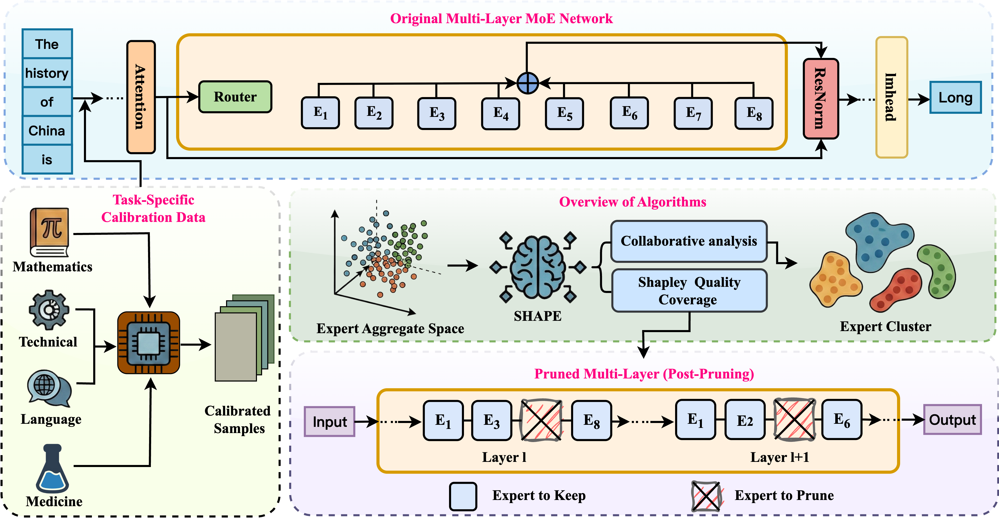
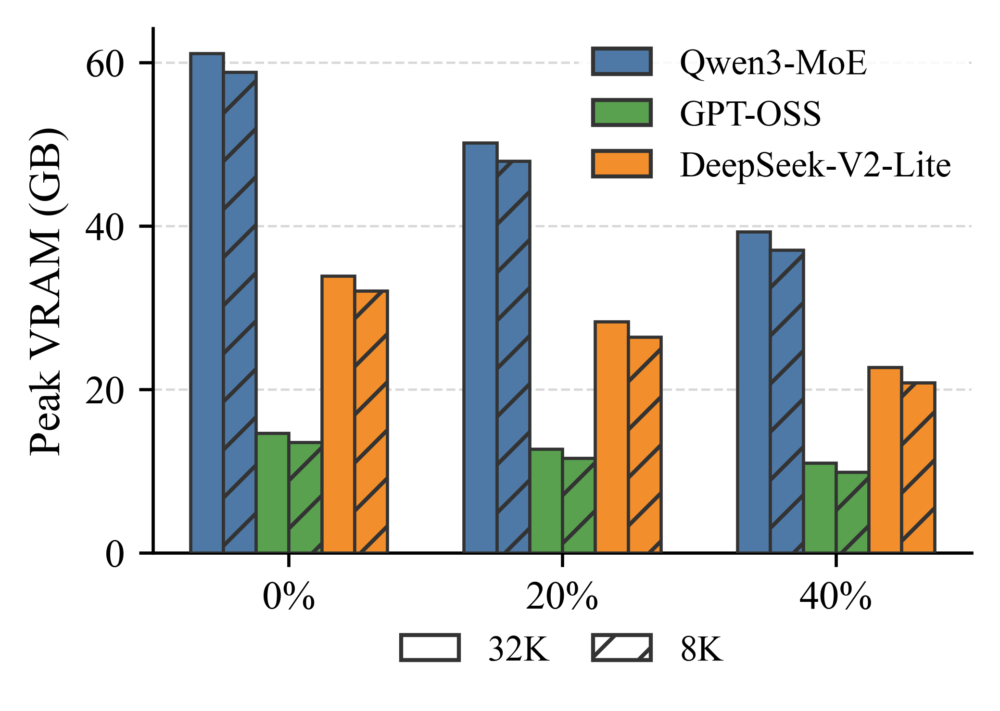

# SHAPE: Coalition-Aware Expert Pruning for Sparse MoE LLMs

**SHAPE** (**SH**apley-**A**ware **P**runing of **E**xperts) is a training-free framework for pruning sparse Mixture-of-Experts (MoE) language models. It values experts inside the routed expert coalitions observed on a small calibration set, then preserves the most useful experts at a target keep rate.

> **SHAPE: Coalition-Aware Expert Pruning for Sparse Mixture-of-Experts LLMs** (IJCNN 2026)
>
> [Paper](https://arxiv.org/abs/2606.09886) · [Quick start](docs/quickstart.md) · [Precomputed activations](https://github.com/Alizen-1009/Shapley-Moe/releases/tag/activation-data-v1) · [Project structure](PROJECT_STRUCTURE.md)

<p align="center">
  
</p>

## Highlights

- **Coalition-aware:** values experts by their marginal contribution to observed routed groups rather than in isolation.
- **Training-free:** uses a calibration pass without gradient updates or expert retraining.
- **Layer-aware:** preserves contribution mass per layer while matching a global keep rate.
- **Architecture-preserving:** keeps the pretrained router and MoE structure unchanged.
- **Broad evaluation:** supports three MoE families, eleven calibration datasets, and five pruning baselines.

## Results

The reported experiments use 25 calibration examples per task. A keep rate of `0.8` retains 80% of experts; `0.6` retains 60%.

| Model | Unpruned | Keep 80% | Keep 60% |
| --- | ---: | ---: | ---: |
| Qwen3-30B-A3B | 82.92 | 82.43 | 81.31 |
| GPT-OSS-20B | 82.12 | 82.44 | 79.02 |
| DeepSeek-V2-Lite | 62.08 | 62.44 | 58.81 |

On Qwen3-30B-A3B, SHAPE retains an average score of **81.31** at a 60% keep rate, compared with 79.05 for EASY-EP and 74.22 for the REAP/RAEP-style baseline. See the [paper](https://arxiv.org/abs/2606.09886) for per-task results and ablations.

<p align="center">
  
</p>

## Quick Start

The shortest reproduction path uses the published activation snapshot and does not require running model inference:

```bash
git clone git@github.com:Alizen-1009/Shapley-Moe.git
cd Shapley-Moe

./data/download_activations.sh
./analysis/run_calc_shapley.sh -m qwen3-30b-a3b -d gsm8k_25
./pruning/run_select.sh -m qwen3-30b-a3b -d gsm8k_25 -M shapley -r 0.8
```

For environment setup, model configuration, the complete collect-to-evaluate pipeline, and adaptive LoRA recovery, see **[docs/quickstart.md](docs/quickstart.md)**.

## How It Works

```text
Calibration data
      ↓
Collect routed expert coalitions
      ↓
Estimate per-layer Shapley contributions
      ↓
Select experts by contribution coverage
      ↓
Export and evaluate the pruned model
```

The recommended `alpha_per_layer` strategy keeps the smallest high-value expert set whose cumulative contribution reaches a per-layer threshold. Bisection adjusts that threshold until the requested global keep rate is met.

## Supported Models

| Config name | Experts | Experts/token | Family |
| --- | ---: | ---: | --- |
| `qwen3-30b-a3b` | 128 | 8 | Qwen3 MoE |
| `gpt-oss-20b` | 32 | 4 | GPT-OSS MoE |
| `deepseekv2-lite-coder` | 64 | 6 | DeepSeek-V2 MoE |

## Pruning Methods

| Method | Signal |
| --- | --- |
| `shapley` | Coalition-aware Shapley contribution (SHAPE) |
| `easyep` | Task-aligned expert selection |
| `reap` | Weighted activation norm |
| `gating` | Mean router score |
| `frequency` | Expert activation count |
| `random` | Uniform random selection |

Datasets, methods, keep rates, and evaluation defaults are defined in [`configs/experiments.yaml`](configs/experiments.yaml).

## Repository Layout

```text
configs/      Model paths and experiment definitions
data/         Calibration data and download/distillation scripts
analysis/     Activation collection and Shapley scoring
pruning/      Expert selection and model export
evaluation/   vLLM serving and EvalScope evaluation
finetune/     Optional adaptive-LoRA recovery
results/      Compact scores, selections, rank maps, and reports
```

Generated activations, distilled data, adapters, and exported models are excluded from Git. Precomputed activations can be restored with `./data/download_activations.sh`.

## Citation

```bibtex
@inproceedings{zhang2026shape,
  title         = {SHAPE: Coalition-Aware Expert Pruning for Sparse Mixture-of-Experts LLMs},
  author        = {Zhang, Yuhao and Jiang, HongXu and Zhang, YiXiang and Zhang, Zheng},
  booktitle     = {Proceedings of the International Joint Conference on Neural Networks},
  year          = {2026},
  eprint        = {2606.09886},
  archivePrefix = {arXiv},
  primaryClass  = {cs.LG}
}
```
